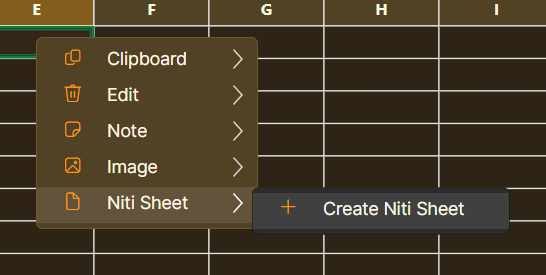

# Niti Sheet — Spreadsheet, structured data and chatbot tools

> **Niti Sheet · Corrected Complete User Manual**

Use this guide to create workbooks, manage data, use formulas, create charts, build forms, use the chatbot tools, and print completed sheets.

---

> **Important:** each screenshot appears only in the feature it documents. In particular, the Intent / FAQ screenshots belong only to **Data → Chatbot → Create**; Batch Edit is documented separately.

---

## Contents

1. [Start and screen](#1-start-and-screen-overview)
2. [File](#2-file-tab)
3. [Home](#3-home-tab)
4. [Insert](#4-insert-tab)
5. [Data: sort, quality & forms](#5-data-tab-data-tools-quality-and-forms)
6. [Data → Chatbot → Create](#6-data--chatbot--create)
7. [Data → Batch Edit](#7-data--batch-edit)
8. [Row and column menus](#8-right-click-row-and-column-menus)
9. [Review and View](#9-review-and-view-tabs)
10. [Print and PDF](#10-print-and-pdf)
11. [Complete reference](#11-complete-reference-saving-formulas-import-forms-and-licensing)

---

## 1. Start and screen overview

Niti Sheet is a desktop spreadsheet program. A typical workflow is: create/open a workbook, enter data, format or calculate it, save it, then print or export the result.

1. Choose `File → New` for a blank workbook, or `File → Open` to continue a saved workbook.
2. Click a cell, type a value, and press Enter. Use the formula bar for longer values and formulas.
3. Save regularly with `File → Save`.

*Main screen: ribbon tabs at the top, formula bar underneath, worksheet grid in the centre, and sheet tabs at the bottom.*

---

## 2. File tab

Select `File` in the ribbon.

| Button | Use |
|--------|-----|
| New | Creates a blank workbook. |
| Open | Opens an existing Niti Sheet workbook from your computer. |
| Save | Saves the current workbook, including sheets, values, formulas and formatting. |
| CSV Import | Imports a comma-separated-value table into a sheet. |
| CSV Export | Exports simple sheet data as a CSV file for use in another program. |

*File ribbon: New, Open, Save, CSV Import and CSV Export.*

---

## 3. Home tab

Select the target cell or range first, then choose `Home`.

| Button | Use |
|--------|-----|
| Paste / Copy / Cut | Pastes copied cells, copies a selection, or moves a selection. |
| Undo / Redo | Reverses the latest action or restores an undone action. |
| Font / size | Sets the font family and size for selected cells. |
| Bold / Italic | Applies bold or italic text. |
| Fill / Text | Changes the cell background or text colour; each palette has a reset option. |
| Left / Center / Right | Aligns cell content horizontally. |
| Wrap | Displays long cell content on multiple lines. |
| Auto Size | Resizes selected cells to suit their contents. |
| Layout | Contains Merge Cells, Unmerge Cells, Wrap Text, Auto Size Cells, AutoFit Columns and AutoFit Rows. |

*Home ribbon commands.*

*Home → Layout menu.*

---

## 4. Insert tab

Select `Insert` in the ribbon.

| Group | Button and use |
|-------|---------------|
| Sheets | **New** adds a worksheet; **Rename** changes the active sheet name; **Delete** removes the active sheet. |
| Nested Cell | **Open** opens a detail sheet attached to the selected cell. **Close** returns to the parent worksheet. |
| Chart | **Chart** shows a chart; **Insert** creates one from selected data; Copy, Cut, Paste, Edit and Delete manage the selected chart. |
| Image | **Image** imports an image; **Delete** removes the selected image. |
| Table | Formats the selected range as a table. |

*Insert ribbon commands.*

---

## 5. Data tab: data tools, quality and forms

Select `Data` in the ribbon.

| Group | Button and use |
|-------|---------------|
| Import Export | CSV Import and Export exchange simple tables. The JSON button is for its own structured-data function; it is not the Chatbot Create button. |
| Sort Filter | **A–Z** and **Z–A** sort the selected column. **Filter** shows rows meeting a condition; **Clear** removes the active filter. |
| Quality | **Dashboard** opens the data-quality dashboard. **Designer** opens the Schema-to-Form Designer. |
| Conditions | **Validate** sets a validation rule; **Check** checks against configured rules; **Clear** removes validation; **High/Low** applies conditional highlighting. |

*Data ribbon. Chatbot and Batch Edit are separate buttons and are documented below.*

*Data → Quality → Dashboard: summary of quality indicators.*

*Data → Quality → Designer: define fields for a form.*

*View → Show Form: opens the form for data entry.*

### Validation, forms and Nested Sheet fields

Select a range, then choose `Data → Conditions → Validate` to set an input rule. Use **Check** to check configured rules. In the Designer, define the field information and use `View → Show Form` when ready to enter data through the form.

### Create a Nested Sheet through validation

1. Open `Data → Quality → Designer` and add or select the field.
2. Open the field's **Input Rules**.
3. Set **Input type** to **Nested Sheet**.
4. Set the field rules required for that field: Required, Unique, Allow null/blank, Default value and Example value.
5. Under **Nested schema designer**, choose **Design Nested Schema** to define the columns/fields of the child sheet.
6. In Design Nested Schema, choose **Add Master Formula**. Enter the master cell name (for example, `1!`), select or enter a Master Shell formula, then choose Add. The formula is applied when a nested sheet is created from the schema.

> **Result:** this field stores a nested child sheet with its own schema, rather than only a single text or number value.

*Input Rules: choose the field input type.*

*Advanced Nested Sheet settings: enter the fields for the nested sheet's first row, choose the nested cell name source, then Apply. Double-clicking the cell creates or opens its nested Niti Sheet; the typed cell value becomes the nested-sheet name and the first-row fields can be prefilled automatically.*

*Design Nested Schema window: add fields for the nested sheet. A field can itself use Nested Sheet to open another child schema, allowing unlimited nested levels. Use Add Field, then Apply when the nested schema is ready.*

*Nested schema structure created for a Nested Sheet field.*

*Schema metadata settings.*

---

## 6. Data → Chatbot → Create

This is the Intent / FAQ chatbot workflow. It is separate from Batch Edit and should be used only when you are creating or managing chatbot intents.

1. Choose `Data → Chatbot → Create`.
2. When Intent Workspace asks whether to create an Intent / FAQ sheet, choose **Create Intent Sheet**.
3. In the Intent / FAQ Workspace, choose **New Intent**, then enter the intent label, primary language, primary response, example questions and optional localized responses.
4. Use the test panel to enter a user question and choose **Run Test**. Use **Capture Baseline** before changing intent examples if you want to compare results later.
5. Use the export option that matches where the completed chatbot will be used.

### Five chatbot export options

| Export | What it creates |
|--------|----------------|
| Export Package | A chatbot-ready assistant package containing the Intent / FAQ data. |
| Export Embed | A standalone embedded chatbot demo page and an iframe embed snippet for a website. |
| Export Widget | A floating chatbot widget loader, companion chatbot page and snippet. |
| Client Bundle | A ready-to-share folder containing assistant JSON, embed page, widget files, snippets and README; repeated exports retain version history. |
| Hosted Config | A server-oriented configuration JSON containing the assistant payload, branding, analytics settings and asset-file names for a hosted bot setup. |

*Step 2: choose Create Intent Sheet.*

*Step 3: Intent / FAQ Workspace.*

*Step 3: enter an intent, response and examples.*

*Step 4: test assistant matching, baseline and multilingual analytics.*

---

## 7. Data → Batch Edit

Batch Edit is a separate spreadsheet tool. It does not create or manage chatbot intents.

1. Choose `Data → Batch Edit → Batch`.
2. Choose the operation, for example **Remove duplicate rows**.
3. Choose where to apply it, such as **All used cells**.
4. For duplicate removal, choose the column used for comparison.
5. Read the message explaining the result, then choose **Apply** or **Cancel**.

> **Example shown:** "Remove duplicate rows" keeps the first matching data row and removes later duplicate rows. Row 1 is kept as the header.

*Data → Batch Edit → Batch: select the operation, target range and comparison column before applying.*

---

## 8. Right-click row and column menus

Right-click a column letter or row number for commands that apply to that whole column or row.

*Column menu: select, AutoFit, Sort, Filter, Insert, Delete and Freeze.*

*Column sorting options.*

*Column filter conditions.*

*Insert a column before or after.*

*Row menu: select, AutoFit, Insert, Delete and Freeze.*

*Freeze the top row to keep headings visible.*

### Cell right-click menu

Right-click a cell for Clipboard commands, Add Note, Import Image and Niti Sheet options.

### Create a Niti Sheet from a cell

1. Right-click the cell that will hold the nested sheet.
2. Choose `Niti Sheet → Create Niti Sheet`.
3. The cell receives a nested Niti Sheet. Open the same menu or double-click it to work with the nested sheet.

*Right-click a cell → Niti Sheet → Create Niti Sheet.*

*Clipboard: Copy, Copy Formula Ref, Cut and Paste.*

*Note → Add Note.*

*Image → Import Image.*

---

## 9. Review and View tabs

### Review

`Review → Find` locates text or values. `Review → Replace` finds matching values and replaces them; review the target carefully before applying a broad replacement.

*Review ribbon: Find and Replace.*

### View

| Button | Use |
|--------|-----|
| Show Form | Opens the current sheet as a form. |
| Master Shell: Show / Formula | Shows/hides the Master Shell row or sets its formula. |
| Zoom Out / Reset / Zoom In | Changes the worksheet display scale. |
| Softer / Stronger | Changes the grid-line visibility. |
| Theme | Chooses a light or soft-dark appearance theme. |
| Setup / Print / PDF / Show Area | Controls page setup, printing, PDF output and print-area display. |

*View ribbon commands.*

*View → Theme → Light Themes.*

*View → Theme → Soft Dark Themes.*

*Formula picker: select a supported formula for the selected cell.*

---

## 10. Print and PDF

1. Choose `View → Setup`.
2. Set paper, orientation, dimensions, margins and print range.
3. Choose `View → Print` for a printer, or `View → PDF` for PDF output.
4. Check the preview before final output.

*Page Setup.*

*Print Preview.*

---

## 11. Complete reference: saving, formulas, import, forms and licensing

### Save, autosave and recovery

- Choose `File → Save`. The first save asks for a file name and location; later saves use the same path.
- An asterisk in the title means the workbook has unsaved changes.
- On a normal close, choose **Save**, **Don't Save**, or **Cancel**.
- After an unexpected close or power loss, Niti Sheet can offer the latest autosave backup on the next launch. Choose Yes to open it or No to ignore that backup.

### Formula entry and references

- Formulas begin with `=`. The formula bar and selected cell show the same formula/value.
- Use the function picker to insert a function skeleton such as `=AVERAGE()`.
- Press **F3** to enter range-pick mode; select a cell/range, then press Enter once to insert the reference. Press Escape to cancel.
- Press **F4** to cycle a reference through A1, $A$1, A$1 and $A1.
- Examples: `=SUM(A1:A10)`, `='Sheet 2'!A1`, and nested-sheet path `=A2#B6#H6`.

### CSV import choices

Choose `File → CSV Import` or `Data → Import Export → CSV Import`. Before importing, select whether to replace current cells or append below existing data. Multiple CSV files can be imported as one batch. When duplicate removal is selected, choose the header/column used for matching; the first row is treated as the header.

### Charts and images

Use `Insert → Chart → Insert` to create a chart from selected data. Charts can be copied, cut, pasted, edited, deleted, moved and resized. Use `Insert → Image` to import an image; images can be moved, resized and are saved with the workbook.

### Master Shell row

Choose `View → Master Shell → Show` to display the optional fixed bottom row. Choose **Formula** to set its formula. Master cells use names such as `1!`, `2!` and `3!`.

### JSON Data Centre

The `Data → Import Export → JSON` button is separate from Chatbot Create. Plain JSON exports typed records and represents nested Niti Sheets as nested objects. Complete Sheet JSON preserves workbook information such as formulas, styles, validations, notes, charts, images, merged ranges and sizes. JSON import can create nested Niti Sheets from nested objects or arrays.

### Form View

Choose `View → Show Form` to edit the current sheet row by row. The form provides previous, next and new-row navigation; writes edits back to the worksheet; and can open nested Niti Sheets in their own form windows. List, true/false, date, time and date-time fields use appropriate editors, while invalid values show an inline error.

### Print Preview

Choose `View → Print` to open Niti Sheet's internal print preview. From the preview, use Page Setup, Save PDF, Save HTML or Close. Use `View → Show Area` to show or hide the printable page-area boundaries in the worksheet.

### Licensing

Use the License button in the title bar to activate a paid license or demo. Without an active license, you can still work in memory with sheets, formulas, imports, charts, forms, formatting and print preview; saving a .cellsheet workbook, autosave, CSV export and JSON sheet export can be restricted until activation succeeds.

### Useful mouse and keyboard actions

- Right-click a cell → `Niti Sheet → Create Niti Sheet` creates a nested sheet.
- Double-click opens an **existing** nested sheet; it does not create one by accident.
- Alt-click a cell containing an `http://` or `https://` link to open it in the default browser.
- Click a column letter or row number to select that full column or row. Use Shift to extend a selection.

---

*Niti Sheet User Manual — revised to keep each feature and its screenshots in the correct section.*
